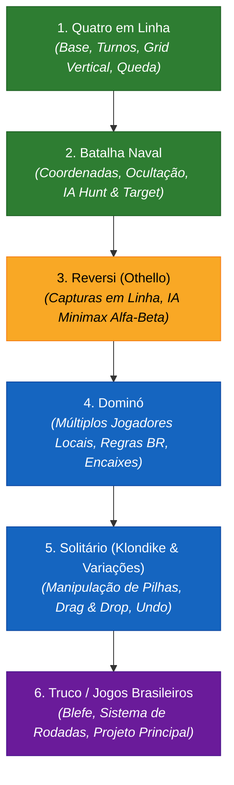

# 🚀 Estágios de Desenvolvimento e Roadmap Estratégico

Este documento detalha o planejamento por etapas, a ordem de implementação recomendada para aprendizado contínuo e consolidação técnica, bem como o estado de cada fase do ecossistema.

---

## 🎯 A Ordem Recomendada de Implementação

Para otimizar o desenvolvimento, a arquitetura e a sofisticação das IAs locais, a seguinte progressão foi estabelecida:

### Racional de cada etapa:
1. **Quatro em Linha:** Aprender a estrutura básica do motor, gerenciador de cenas, verificação de vitória vetorial e animação suave com *tweens*. *(✅ Concluído)*
2. **Batalha Naval:** Praticar grids múltiplos (ataque vs defesa), posicionamento procedural de frotas e IA heurística de caça (*Hunt & Target*). *(✅ Concluído)*
3. **Reversi:** Aprofundar lógica matemática e implementar algoritmos de tomada de decisão com Minimax e poda Alfa-Beta para oponentes inteligentes. *(🟡 Em andamento)*
4. **Dominó:** Lidar com regras brasileiras, compra de pedras, fechamento de mesa e suporte a 2 a 4 jogadores (IA ou local compartilhado). *(📋 Próximo)*
5. **Solitário:** Criar uma experiência de cartas rica, com validação de regras complexas, pilhas visuais, movimentação fluida e histórico para botão *Desfazer*. *(📋 Próximo)*
6. **Truco / Jogos Brasileiros:** Projeto principal com IA de blefe, contagem de tentos e identidade visual brasileira original. *(💡 Backlog Principal)*

---

## 📦 Fases do Roadmap

### Fase 1: Fundação & Jogos de Tabuleiro Core (Status: 100% Concluído)
- [x] **Arquitetura Base:** Gerenciador de cenas ([`SceneManager.gd`](file:///Users/sierra/Dev/Jogos/core/navegacao/SceneManager.gd)), persistência local ([`SaveManager.gd`](file:///Users/sierra/Dev/Jogos/core/save/SaveManager.gd)) e tema central.
- [x] **Menu Principal & Menus de Categoria:** Navegação entre telas de Tabuleiro, Cartas e Configurações.
- [x] **Quatro em Linha:** Grade 7×6, física de queda, detecção de 4 em linha, modo IA.
- [x] **Batalha Naval:** Grade dupla 10×10, 5 navios, IA de busca e destruição, interface de abas.
- [x] **Damas:** Tabuleiro 8×8, damas promovidas, capturas múltiplas em cadeia, IA responsiva.
- [x] **Jogo da Velha:** Grade 3×3 clássica para testes rápidos de UI e partidas instantâneas.
- [x] **Reversi:** Finalização da lógica minimax e UI 8x8 no módulo dedicado.
- [x] **Ludo Simplificado:** 4 jogadores (Humano + IAs) e capturas.
- [x] **Senet Egípcio:** Trilha 3x10, varetas de lançamento e casas sagradas.
- [x] **Solitário (Resta Um):** Cruz de 33 furos e avaliação.
- [x] **Dominó Brasileiro:** Modo clássico individual, regras de encaixe e contagem de pontos.

---

### Fase 2: Expansão de Cartas & Lógica Casual (Status: 100% Concluído)
- [x] **Blackjack (21 Simplificado):** Baralho completo de 52 cartas, cálculo de Ás flexível (1/11), lógica de Dealer (para em 17).
- [x] **Jogo da Memória:** Emojis dinâmicos, animações 3D de virada de carta (*flip effect*), controle de pares encontrados.
- [x] **Solitário (Klondike):** Validação de colunas decrescentes, fundações por naipe e pilha de compras.
- [x] **Cartas das Cores (Uno):** Cartas de ação e IA.
- [x] **Poker (Video Poker):** 5 cartas, seleção de HOLD e pagamentos.
- [x] **Mancala:** Semeadura circular e captura de sementes.
- [x] **Campo Minado:** Revelação recursiva de células vazias e contagem numérica de minas.

---

### Fase 3: Jogos de Mesa Nacionais & Multiplayer Local (Status: Planejado)
- [ ] **Sudoku:** Gerador procedural com níveis de dificuldade e anotações a lápis.
- [ ] **Truco contra IA:** Regras Paulista e Mineiro, sistema de pedidos de Truco/6/9/12 e blefes simulados.
- [ ] **Buraco / Canastra Offline:** Distribuição de cartas, formação de jogos limpos/sujos, pegada de morto e batida.
- [ ] **Desafios Diários Offline:** Geração determinística de desafios (Solitário e Sudoku) baseada na data local do sistema (`OS.get_date()`), sem necessidade de servidor.

---

### Fase 4: Polimento, Áudio & Distribuição (Status: Em Andamento)
- [x] **Script de Build Android:** Script automatizado [`build_apk.sh`](file:///Users/sierra/Dev/Jogos/build_apk.sh) com assinatura local (`release.keystore`).
- [x] **Preset de Exportação:** Configuração parametrizada em [`export_presets.cfg`](file:///Users/sierra/Dev/Jogos/export_presets.cfg).
- [ ] **Efeitos Sonoros (SFX):** Sons procedurais ou livres de royalties (colocação de peças, virada de cartas, vitória e derrota).
- [ ] **Distribuição Open Source:** Publicação nas lojas e repositórios livres (F-Droid, GitHub Releases e APK direto).
- [ ] **Suporte iOS (Xcode):** Exportação para macOS/iOS via Mac host.
