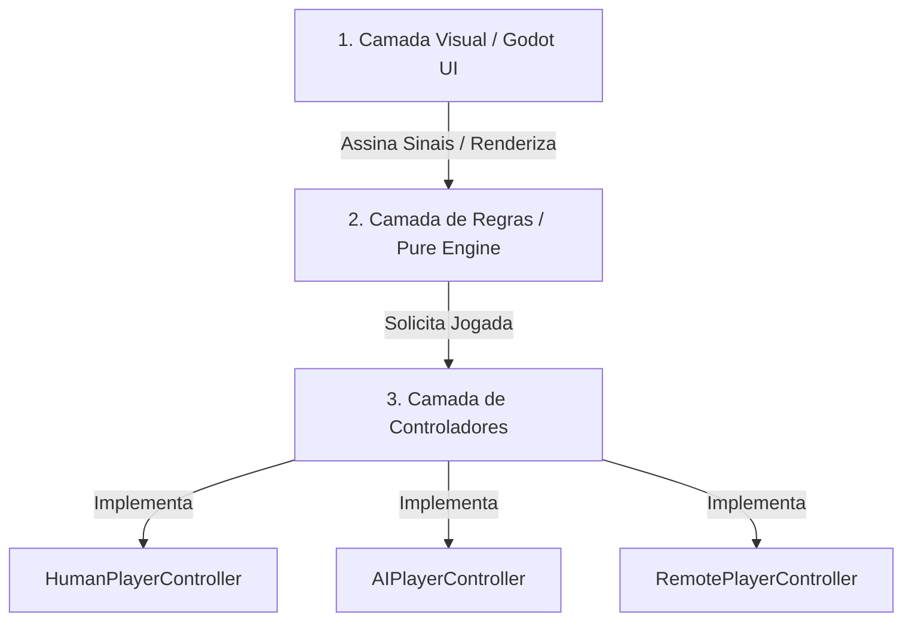

# 🚀 Guia de Arquitetura Modular, Portabilidade e Multiplayer

Este documento descreve a arquitetura refatorada do projeto **Jogos de Mesa Offline**, os módulos universais criados e como portar facilmente qualquer jogo para outras linguagens/plataformas ou plugar o modo online.

---

## 🏛️ 1. Arquitetura em 3 Camadas

O projeto foi desacoplado em 3 camadas independentes:



### 1. Camada de Apresentação (`games/*/` e `shared/ui/`)
- Contém nós visuais do Godot (`Control`, `Button`, `Label`, `Tween`).
- Não calcula regras matemáticas nem estados complexos. Apenas lê o estado da `core_engine` e desenha na tela.

### 2. Camada de Regras e Entidades (`shared/core_engine/`)
- 100% código puro (`RefCounted`), sem dependência de nós ou renderizadores gráficos.
- Totalmente determinística e serializável via `to_dict()` e `from_dict()`.

### 3. Camada de Controladores de Jogadores (`shared/core_engine/players/`)
- Permite que qualquer jogo funcione em 3 modos sem alterar as regras:
  - **1 Jogador (vs IA):** Usa `AIPlayerController` com a estratégia da IA.
  - **2 Jogadores (Local / Pass and Play):** Alterna entre dois `HumanPlayerController`.
  - **Multiplayer Online:** Usa `RemotePlayerController` para receber jogadas remotas.

---

## 📂 2. Estrutura de Pastas

```text
shared/
└── core_engine/
    ├── cards/                   # Módulo Universal de Cartas
    │   ├── Card.gd              # Classe de Carta com naipes, cores, valores e serialização
    │   ├── Deck.gd              # Baralho com fábricas (52 cartas, Uno, Memória)
    │   ├── CardHand.gd          # Mão de cartas (adicionar, remover, ordenar, buscar)
    │   └── CardPile.gd          # Pilha de descarte, monte ou fundação
    │
    ├── board/                   # Módulo Universal de Tabuleiro
    │   ├── Grid2D.gd            # Matriz 2D com vizinhança, streak e serialização
    │   ├── BoardCoord.gd        # Constantes de direções (cardinais, diagonais, 8 vias)
    │   └── Piece.gd             # Peça lógica genérica
    │
    ├── players/                 # Módulo de Jogadores e Turnos
    │   ├── Player.gd            # Entidade de Jogador (id, nome, tipo)
    │   ├── TurnManager.gd       # Orquestrador do ciclo de turnos
    │   ├── IPlayerController.gd # Interface base para tomada de decisões
    │   ├── HumanPlayerController.gd # Controlador local por UI
    │   ├── AIPlayerController.gd    # Controlador por algoritmos de IA
    │   └── RemotePlayerController.gd# Controlador por rede/multiplayer
    │
    └── network/                 # Contrato de Rede
        └── GameAction.gd        # Ação serializável em JSON (player_id, action_type, payload)
```

---

## 🌐 3. Como Implementar Multiplayer Online

Toda interação de jogo é representada por um `GameAction`:

```json
{
  "player_id": 1,
  "action_type": "drop_piece",
  "payload": {
    "col": 3
  },
  "timestamp": 1720000000.0
}
```

### Passo a passo para jogar online via WebSocket / WebRTC:
1. Ao iniciar a partida, instancie um `HumanPlayerController` para o jogador local e um `RemotePlayerController` para o jogador remoto.
2. Quando o jogador local jogar na interface, seu `HumanPlayerController` emite `GameAction`.
3. Envie o JSON desse `GameAction` pela rede (`WebSocketClient.send_text(action.to_json())`).
4. Ao receber o pacote JSON do oponente remoto, chame `remote_controller.receive_json(received_text)`.
5. O `GameEngine` processará a jogada exatamente como se fosse uma jogada local!

---

## 📱 4. Como Portar para Outras Linguagens e Plataformas

Como a camada `core_engine` não depende de classes visuais do Godot, portar para outra stack é um processo direto de tradução de classes:

### Exemplo em Flutter (Dart):
```dart
class Card {
  final int value;
  final int suit;
  final int colorType;
  final String cardType;
  bool isFaceUp;

  Card({required this.value, required this.suit, required this.colorType, this.cardType = 'standard', this.isFaceUp = true});

  Map<String, dynamic> toJson() => {
    'value': value, 'suit': suit, 'colorType': colorType, 'cardType': cardType, 'isFaceUp': isFaceUp
  };
}
```

### Exemplo em TypeScript (React Native / Node.js):
```typescript
export interface GameAction {
  playerId: number;
  actionType: string;
  payload: Record<string, any>;
  timestamp: number;
}

export class Grid2D<T> {
  constructor(public rows: number, public cols: number, public cells: T[] = []) {}
  isValid(r: number, c: number): boolean {
    return r >= 0 && r < this.rows && c >= 0 && c < this.cols;
  }
}
```
