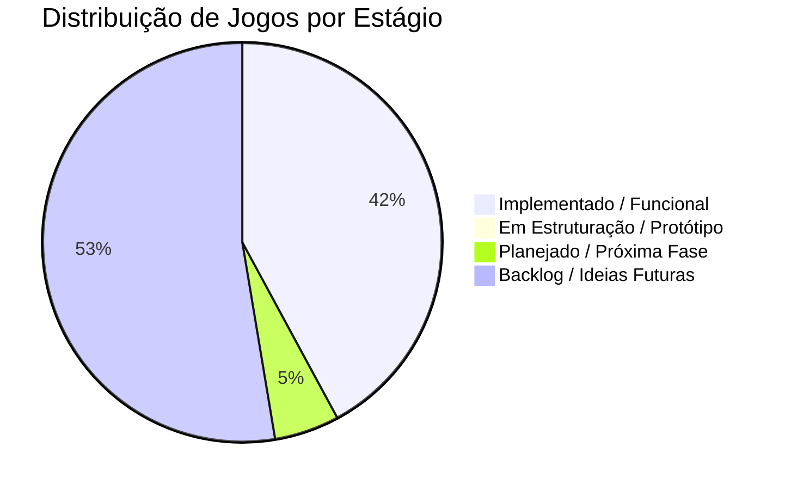

# 📚 Documentação: Jogos de Mesa Offline

Bem-vindo à central de documentação do ecossistema **Jogos de Mesa Offline**.

Aqui você encontra a listagem detalhada de todos os jogos previstos, seus estágios de desenvolvimento, diretrizes técnicas de arquitetura, comparação de stacks (Godot vs Flutter), modelos de distribuição livre (sem anúncios) e cuidados legais.

---

## 🗂️ Mapa da Documentação

| Documento | Descrição |
| :--- | :--- |
| [Catálogo Completo de Jogos e Estágios](CATALOGO_JOGOS.md) | Lista exaustiva de todos os jogos possíveis (Recomendações, Cartas, Tabuleiro, Brasileiros), regras, stack recomendada e status atual de cada um. |
| [Estágios e Roadmap de Desenvolvimento](ESTAGIOS_E_ROADMAP.md) | Cronograma de implementação, fases da esteira de produção e a ordem estratégica recomendada de execução. |
| [Arquitetura e Stacks (Godot vs Flutter)](ARQUITETURA_E_STACK.md) | Estrutura modular (`core/`, `shared/`, `games/`), isolamento de regras de negócio, persistência local e guia de escolha de engine por tipo de jogo. |
| [Guia de Arquitetura, Portabilidade e Multiplayer](GUIA_ARQUITETURA_E_PORTABILIDADE.md) | Módulos universais de cartas (`Card`, `Deck`), tabuleiros (`Grid2D`), jogadores (`IPlayerController`, `AI`, `Network`) e como portar para Flutter/TS/C#. |
| [Ciclo de Vida Compartilhado dos Jogos](CICLO_DE_VIDA_DOS_JOGOS.md) | Levantamento da duplicação entre os 16 jogos, o que `GenericGame` cobria de fato e o desenho de `BaseGame`/`GridGame` em `shared/`. |
| [Diretrizes Open Source, Sem Anúncios e Legais](DIRETRIZES_SEM_ANUNCIOS_E_LEGAIS.md) | Princípios de privacidade (offline-first, zero ads, zero telemetria), geração procedural de assets e proteção legal para jogos tradicionais. |

---

## 📊 Resumo Executivo dos Estágios

### Legenda de Estágios:
- ✅ **Implementado e Funcional:** Código de gameplay, IA/PvP e interface finalizados no repositório.
- 🟡 **Em Estruturação / Protótipo:** Cenas criadas ou estrutura de pastas/menu iniciada, aguardando lógica completa.
- 📋 **Planejado / Próxima Fase:** Especificações e regras desenhadas, priorizado na ordem de desenvolvimento.
- 💡 **Backlog / Ideias Futuras:** Mapeado conceitualmente para fases de expansão e spin-offs.
- 🚫 **Adiado Inicialmente:** Jogos complexos ou dependentes de rede evitados na fase inicial (ex: Xadrez, Go, Multiplayer Online).

---

Para detalhes sobre cada jogo, acesse o [Catálogo Completo de Jogos](CATALOGO_JOGOS.md).
